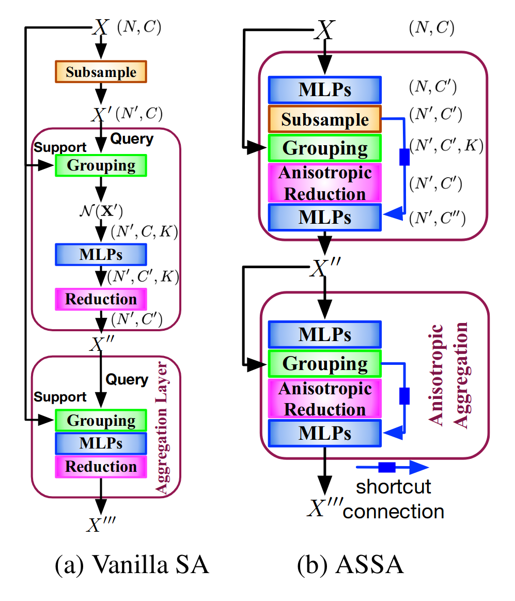
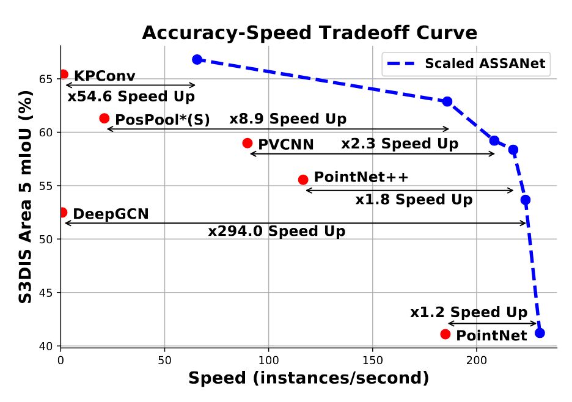

# ASSANet
This is official repository of NeurIPS 2021 spotlight paper: [ASSANet: An Anisotropical Separable Set Abstraction forEfficient Point Cloud Representation Learning](https://arxiv.org/abs/2110.10538).  

<p float="middle">
    
     
</p>


## Installation
### Datasets
**Scene Segmentation on S3DIS**
Download the S3DIS dataset from [here](https://goo.gl/forms/4SoGp4KtH1jfRqEj2") (4.8 GB). You only need to download the file named `Stanford3dDataset_v1.2.zip`, unzip and move (or link) it to `data/S3DIS/Stanford3dDataset_v1.2`.

The file structure should look like:
```
<pt-code-root>
├── cfgs
│   └── s3dis
├── data
│   └── S3DIS
│       └── Stanford3dDataset_v1.2
│           ├── Area_1
│           ├── Area_2
│           ├── Area_3
│           ├── Area_4
│           ├── Area_5
│           └── Area_6
├── init.sh
├── datasets
├── function
├── models
├── ops
└── utils
```

### Environment install
Make sure install CUDA 11.1 
```bash
source init.sh
```

## Usage
### Training

* ASSA-Net:
    ```bash
    python -m torch.distributed.run --nnodes 1 --nproc_per_node 1 function/main_s3dis_dist.py --cfg cfgs/s3dis/assanet.yaml
    ```
* ASSA-Net (L):
    ```bash
    python -m torch.distributed.run --nnodes 1 --nproc_per_node 1 function/main_s3dis_dist.py --cfg cfgs/s3dis/assanet_scale.yaml model.width 128 model.depth 3
    ```
Note: we trained all models using the default hyperparameters and using only one GPU (32G V100). ASSANet is also trainable in one GTX2080Ti. ASSANet (L) can be trained using multiple GTX2080Ti. 


### Evaluating

For evaluation, 1 GPU is recommended.

Evaluate ASSA-Net:
```bash
python -m torch.distributed.run --nnodes 1 --nproc_per_node 1 \
    function/main_s3dis_dist.py mode=test wandb.use_wandb=False --cfg cfgs/s3dis/assanet.yaml --load_path /path/to/the/ckpt 
```

Evaluate ASSA-Net(L):
```bash
python -m torch.distributed.run --nnodes 1 --nproc_per_node 1 \
    function/main_s3dis_dist.py mode=test wandb.use_wandb=False --cfg cfgs/s3dis/assanet_scale.yaml model.width=128 model.depth=3 --load_path /path/to/the/ckpt
```


# Model Zoo

| Model (S3DIS) | Paper (mIoU, with voting) | Reproduce (with voting / without voting) | Ckpt & Logs                                                  |
| ------------- | ------------------------- | ---------------------------------------- | ------------------------------------------------------------ |
| ASSANet       | 63.0                      | 62.9 / 61.8                              | [Google Drive](https://drive.google.com/drive/folders/1Zw2n2HqKuIFBZ0-jv4WeOqTGXOKgbaeu?usp=sharing) |
| ASSANet-L     | 66.8                      | 66.7 / 64. 3                             | [Google Drive](https://drive.google.com/drive/folders/1nurQnjMnXNs8Fn6UNqNd2u8C2cS09gSX?usp=sharing) |


# Acknowledge

This code is built upon [Closer Look at 3D](https://github.com/zeliu98/CloserLook3D/tree/master/pytorch).


# Cite

```
@inproceedings{qian2021assanet,
  title={ASSANet: An Anisotropical Separable Set Abstraction for Efficient Point Cloud Representation Learning},
  author={Qian, Guocheng and Hammoud, Hasan Abed Al Kader and Li, Guohao and 
          Thabet, Ali and Ghanem, Bernard},
  booktitle={Advances in Neural Information Processing Systems (NeurIPS)},
  year={2021}
}
```

